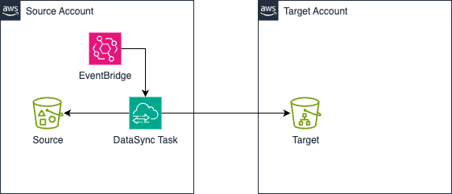

# AWS DataSync Job Terraform Module

This Terraform module provisions resources to automate and schedule the transfer of data between S3 buckets using AWS DataSync, with scheduling handled by Amazon EventBridge Scheduler.

## Overview

This module creates everything needed to securely and efficiently copy or synchronize data between two S3 buckets. It leverages AWS DataSync for the transfer process and uses EventBridge Scheduler to trigger the DataSync task on a configurable schedule.

**Key features:**
- Automated DataSync setup between source and destination S3 buckets.
- IAM roles and policies for secure DataSync and EventBridge operation.
- CloudWatch log group for monitoring DataSync jobs.
- EventBridge Scheduler to trigger DataSync tasks on a schedule (e.g., every N minutes).
- Flexible options for source/destination folders, inclusion/exclusion patterns, and transfer settings.

## Architecture Diagram

